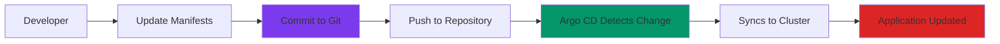
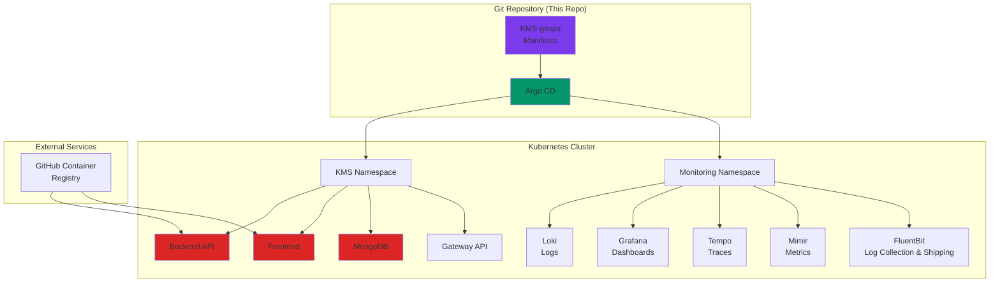
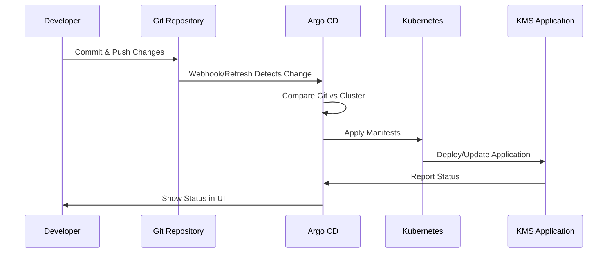
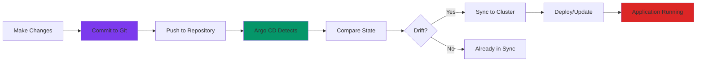
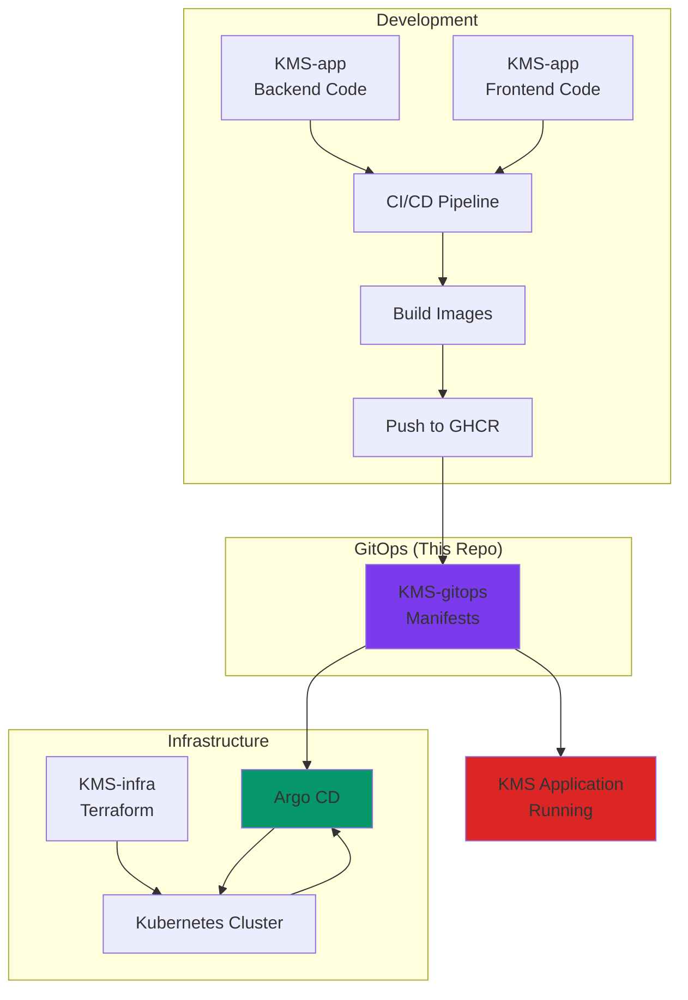
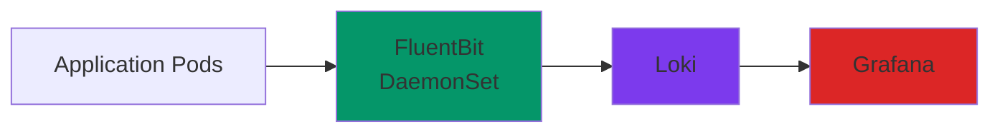

# 🚀 KMS GitOps Repository

> **Kubernetes manifests and GitOps configuration for the Kitchen Management System (KMS)**

This repository contains all Kubernetes manifests, configurations, and Argo CD application definitions for deploying and managing the KMS application stack. It follows GitOps principles, where changes to this repository automatically trigger deployments to the Kubernetes cluster.

---

## 📋 Table of Contents

- [Overview](#-overview)
- [What is GitOps?](#-what-is-gitops)
- [Architecture](#-architecture)
- [Repository Structure](#-repository-structure)
- [Components](#-components)
- [Prerequisites](#-prerequisites)
- [Quick Start](#-quick-start)
- [Configuration](#-configuration)
- [How It Works](#-how-it-works)
- [Integration with KMS Ecosystem](#-integration-with-kms-ecosystem)
- [Monitoring & Observability](#-monitoring--observability)
- [Troubleshooting](#-troubleshooting)

---

## 🎯 Overview

**KMS-gitops** is the GitOps repository that manages the entire KMS application lifecycle on Kubernetes. It provides:

- ✅ **GitOps Workflow** - Version-controlled, automated deployments
- ✅ **Infrastructure as Code** - All Kubernetes resources defined as YAML
- ✅ **Automated Sync** - Argo CD automatically deploys changes
- ✅ **Self-Healing** - Automatic recovery from configuration drift
- ✅ **Complete Stack** - Application, database, gateway, and monitoring

### Why This Repository?

Instead of manually running `kubectl apply` commands, this repository enables:

1. **Version Control** - Track all infrastructure changes in Git
2. **Automated Deployments** - Push to Git → Argo CD syncs → Apps deploy
3. **Rollback Capability** - Revert to any previous version instantly
4. **Audit Trail** - See who changed what and when
5. **Multi-Environment** - Same manifests, different environments
6. **Collaboration** - Review infrastructure changes via Pull Requests

---

## 🔄 What is GitOps?

**GitOps** is a methodology where Git is the single source of truth for infrastructure and application configurations. Changes are made by committing to Git, and an automated system (Argo CD) ensures the cluster matches the Git state.

### GitOps Workflow



**Benefits:**
- 🔒 **Security** - All changes are reviewed and audited
- 🚀 **Speed** - Faster deployments with automation
- 🔄 **Consistency** - Same process for all environments
- 📊 **Visibility** - See deployment status in Argo CD UI

---

## 🏛️ Architecture

### High-Level Architecture



### Application Deployment Flow



---

## 📁 Repository Structure

```
KMS-gitops/
├── apps/                          # Application deployments
│   ├── backend/                   # KMS Backend API
│   │   ├── deployment.yaml        # Backend deployment
│   │   ├── service.yaml           # Backend service
│   │   ├── configmap.yaml         # Configuration
│   │   ├── secret.yaml.template   # Secret template
│   │   └── kustomization.yaml     # Kustomize config
│   │
│   ├── frontend/                  # KMS Frontend
│   │   ├── deployment.yaml        # Frontend deployment
│   │   ├── service.yaml           # Frontend service
│   │   └── kustomization.yaml     # Kustomize config
│   │
│   └── database/                  # MongoDB
│       ├── mongodb-statefulset.yaml
│       ├── mongodb-service.yaml
│       └── kustomization.yaml
│
├── gateway/                       # Gateway API configuration
│   ├── gatewayclass.yaml          # Gateway class
│   ├── gateway.yaml               # Gateway instance
│   ├── httproute-backend.yaml    # Backend routing
│   ├── httproute-frontend.yaml   # Frontend routing
│   └── kustomization.yaml
│
├── monitoring/                     # Observability stack
│   ├── loki/                      # Log aggregation
│   ├── grafana/                   # Dashboards & visualization
│   ├── tempo/                     # Distributed tracing
│   ├── mimir/                     # Metrics storage
│   └── fluentbit/                 # Log collection & shipping
│
├── argocd/                        # Argo CD configuration
│   ├── application.yaml           # Application definitions
│   └── configmap.yaml             # Argo CD config
│
├── namespace.yaml                  # Namespace definitions
└── README.md                      # This file
```

---

## 🧩 Components

### 1. **Application Components** (`apps/`)

#### Backend API (`apps/backend/`)
- **Purpose**: KMS Backend REST API (Node.js/Express)
- **Image**: `ghcr.io/krishnamohankapri/kms-backend:latest`
- **Replicas**: 2 (for high availability)
- **Port**: 8001
- **Resources**: 256Mi-512Mi memory, 250m-500m CPU
- **Health Checks**: Liveness and readiness probes

#### Frontend (`apps/frontend/`)
- **Purpose**: KMS Frontend web application (Angular)
- **Image**: `ghcr.io/krishnamohankapri/kms-frontend:latest`
- **Replicas**: 2 (for high availability)
- **Port**: 80
- **Resources**: Optimized for static content

#### Database (`apps/database/`)
- **Purpose**: MongoDB StatefulSet for persistent data storage
- **Image**: MongoDB official image
- **Storage**: Persistent volumes for data persistence
- **Service**: Headless service for direct pod access

### 2. **Gateway Configuration** (`gateway/`)

#### Gateway API
- **Purpose**: Modern Kubernetes ingress/routing
- **Components**:
  - `GatewayClass`: Defines gateway implementation (Envoy)
  - `Gateway`: Creates load balancer and routes
  - `HTTPRoute`: Routes traffic to backend/frontend services
- **Features**:
  - TLS termination
  - Path-based routing
  - Hostname-based routing

### 3. **Monitoring Stack** (`monitoring/`)

#### Loki
- **Purpose**: Log aggregation system
- **Features**: Stores and queries application logs
- **Integration**: Works with Grafana for log visualization

#### Grafana
- **Purpose**: Visualization and dashboards
- **Features**:
  - Pre-configured dashboards
  - Data sources: Loki, Mimir, Tempo
  - Default credentials: `admin/admin`

#### Tempo
- **Purpose**: Distributed tracing backend
- **Features**: Stores trace data from applications

#### Mimir
- **Purpose**: Metrics storage (Prometheus-compatible)
- **Features**: Long-term metrics storage and querying

#### FluentBit
- **Purpose**: Log collection and shipping daemon
- **Features**: 
  - Collects logs from all pods (DaemonSet)
  - Ships logs directly to Loki
  - Lightweight and efficient log processing

### 4. **Argo CD Applications** (`argocd/`)

#### Application Definitions
Each component has an Argo CD Application that:
- Points to this Git repository
- Defines sync policy (automated/manual)
- Enables self-healing
- Creates namespaces automatically

**Applications:**
- `kms-backend` - Backend API
- `kms-frontend` - Frontend application
- `kms-database` - MongoDB
- `kms-gateway` - Gateway API routes
- `loki` - Log aggregation
- `grafana` - Dashboards
- `tempo` - Tracing
- `mimir` - Metrics
- `fluentbit` - Log collection

---

## 🔧 Prerequisites

Before using this repository, ensure you have:

### Required Infrastructure

1. **Kubernetes Cluster**
   - Deployed via [KMS-infra](../KMS-infra) repository
   - Or any Kubernetes cluster (v1.24+)

2. **Argo CD Installed**
   - Installed in the cluster (done by KMS-infra)
   - Accessible via `kubectl port-forward` or ingress

3. **Gateway API Installed**
   - Gateway API CRDs installed
   - Envoy Gateway installed (done by KMS-infra)

### Required Tools

| Tool | Purpose | Installation |
|------|---------|--------------|
| **kubectl** | Kubernetes cluster management | [Install Guide](https://kubernetes.io/docs/tasks/tools/) |
| **git** | Version control | Usually pre-installed |

### Required Secrets

Before deploying, create the following secrets in the `kms` namespace:

```bash
# Create namespace (if not exists)
kubectl create namespace kms

# Create secrets
kubectl create secret generic kms-secrets \
  --from-literal=mongo-uri="mongodb://mongodb:27017/kms" \
  --from-literal=jwt-secret="your-jwt-secret-here" \
  --from-literal=stripe-secret-key="sk_test_..." \
  --from-literal=stripe-webhook-secret="whsec_..." \
  --from-literal=cloudinary-api-key="your-api-key" \
  --from-literal=cloudinary-api-secret="your-api-secret" \
  --from-literal=gmail-user="your-email@gmail.com" \
  --from-literal=gmail-app-password="your-app-password" \
  --from-literal=edamam-app-key="your-edamam-key" \
  --namespace=kms
```

---

## 🚀 Quick Start

### Step 1: Clone Repository

```bash
git clone <your-repo-url> KMS-gitops
cd KMS-gitops
```

### Step 2: Create Secrets

```bash
# Create secrets as shown in Prerequisites section
kubectl create secret generic kms-secrets \
  --from-literal=mongo-uri="..." \
  --from-literal=jwt-secret="..." \
  --namespace=kms
```

### Step 3: Apply Argo CD Applications

If Argo CD is already installed (via KMS-infra), applications should auto-sync. Otherwise:

```bash
# Apply Argo CD application definitions
kubectl apply -f argocd/application.yaml

# Check application status
kubectl get applications -n argocd
```

### Step 4: Access Argo CD UI

```bash
# Port forward to Argo CD
kubectl port-forward svc/argocd-server -n argocd 8080:443

# Access at: https://localhost:8080
# Username: admin
# Password: kubectl -n argocd get secret argocd-initial-admin-secret -o jsonpath="{.data.password}" | base64 -d
```

### Step 5: Verify Deployments

```bash
# Check all pods
kubectl get pods -n kms
kubectl get pods -n monitoring

# Check services
kubectl get svc -n kms

# Check gateway
kubectl get gateway -n kms
kubectl get httproute -n kms
```

---

## ⚙️ Configuration

### Application Configuration

#### Backend Configuration (`apps/backend/configmap.yaml`)
- Cloudinary settings
- Edamam API configuration
- Other non-sensitive settings

#### Frontend Configuration
- Environment variables
- API endpoints
- Feature flags

### Gateway Configuration

Edit `gateway/httproute-*.yaml` to change:
- Hostnames (currently `api.kms.example.com`, `app.kms.example.com`)
- Path routing rules
- TLS settings

### Monitoring Configuration

#### Grafana
- Default admin credentials: `admin/admin` (change in production!)
- Data sources pre-configured: Loki, Mimir, Tempo
- Edit `monitoring/grafana/grafana-config.yaml` for custom settings

#### Loki
- Storage configuration in `monitoring/loki/loki-config.yaml`
- Retention policies
- Storage backend

### Argo CD Sync Policy

Each application in `argocd/application.yaml` has:

```yaml
syncPolicy:
  automated:
    prune: true      # Delete resources removed from Git
    selfHeal: true   # Auto-sync if cluster drifts from Git
```

**To disable auto-sync:**
```yaml
syncPolicy:
  syncOptions:
    - CreateNamespace=true
  # Remove 'automated' section
```

---

## 🔄 How It Works

### GitOps Workflow



### Deployment Process

1. **Developer makes changes**
   - Edit YAML files in this repository
   - Update image tags, replicas, resources, etc.

2. **Commit and push**
   ```bash
   git add .
   git commit -m "Update backend to v1.2.0"
   git push origin main
   ```

3. **Argo CD detects change**
   - Argo CD polls Git (or receives webhook)
   - Compares desired state (Git) vs actual state (Cluster)

4. **Argo CD syncs**
   - Applies new manifests to cluster
   - Updates deployments, services, etc.
   - Reports status back to Argo CD UI

5. **Application updates**
   - Kubernetes rolling update
   - Zero-downtime deployment
   - Health checks ensure availability

### Self-Healing

Argo CD continuously monitors:
- **Configuration Drift**: If someone manually changes cluster, Argo CD reverts it
- **Resource Deletion**: If pods/services are deleted, Argo CD recreates them
- **Status Monitoring**: Shows health status in Argo CD UI

---

## 🔗 Integration with KMS Ecosystem

### Repository Relationships



### How Repositories Work Together

1. **KMS-infra** (Infrastructure)
   - Provisions Kubernetes cluster
   - Installs Argo CD
   - Connects Argo CD to this repository

2. **KMS-gitops** (This repo - Configuration)
   - Contains all Kubernetes manifests
   - Defines what to deploy
   - Managed by Argo CD

3. **KMS-app** (Application Code)
   - Contains source code
   - Built into container images
   - Images referenced in this repo's manifests

**Complete Workflow:**
```
1. Developer updates KMS-app code
2. CI/CD builds and pushes image to GHCR
3. Developer updates image tag in KMS-gitops
4. Commit and push to KMS-gitops
5. Argo CD detects change
6. Argo CD syncs and deploys new version
7. Application updated in cluster ✅
```

---

## 📊 Monitoring & Observability

### Accessing Monitoring Tools

#### Grafana Dashboards
```bash
# Port forward to Grafana
kubectl port-forward svc/grafana -n monitoring 3000:3000

# Access at: http://localhost:3000
# Default credentials: admin/admin
```

#### View Logs (via Grafana)
1. Open Grafana UI
2. Go to "Explore"
3. Select "Loki" data source
4. Query logs: `{namespace="kms"}`

#### View Metrics (via Grafana)
1. Open Grafana UI
2. Go to "Explore"
3. Select "Mimir" data source
4. Query PromQL: `kube_pod_info{namespace="kms"}`

#### View Traces (via Grafana)
1. Open Grafana UI
2. Go to "Explore"
3. Select "Tempo" data source
4. Search traces by service name

### Pre-configured Dashboards

Grafana comes with:
- **Kubernetes Cluster Overview** - Cluster health
- **Application Metrics** - Pod CPU, memory, network
- **Log Aggregation** - Centralized logs from all pods
- **Distributed Tracing** - Request flow across services

### Log Collection Flow



---

## 🛠️ Troubleshooting

### Common Issues

#### 1. Applications not syncing in Argo CD

```bash
# Check Argo CD application status
kubectl get applications -n argocd

# Describe application for details
kubectl describe application kms-backend -n argocd

# Manually trigger sync
argocd app sync kms-backend
```

#### 2. Pods not starting

```bash
# Check pod status
kubectl get pods -n kms

# Describe pod for events
kubectl describe pod <pod-name> -n kms

# Check logs
kubectl logs <pod-name> -n kms
```

#### 3. Backend can't connect to MongoDB

```bash
# Check MongoDB pod
kubectl get pods -n kms | grep mongodb

# Check MongoDB service
kubectl get svc -n kms | grep mongodb

# Verify MongoDB URI in secret
kubectl get secret kms-secrets -n kms -o jsonpath="{.data.mongo-uri}" | base64 -d
```

#### 4. Gateway not routing traffic

```bash
# Check gateway status
kubectl get gateway -n kms
kubectl describe gateway kms-gateway -n kms

# Check HTTPRoute
kubectl get httproute -n kms
kubectl describe httproute kms-backend-route -n kms

# Check Envoy Gateway pods
kubectl get pods -n gateway-system
```

#### 5. Images not pulling (GHCR authentication)

```bash
# Check if GHCR secret exists
kubectl get secret ghcr-secret -n kms

# If missing, create it (from KMS-infra Ansible)
kubectl create secret docker-registry ghcr-secret \
  --docker-server=ghcr.io \
  --docker-username=<github-username> \
  --docker-password=<github-pat> \
  --namespace=kms
```

#### 6. Argo CD shows "OutOfSync"

```bash
# Check what's different
argocd app diff kms-backend

# Force sync if needed
argocd app sync kms-backend --force
```

### Debugging Commands

```bash
# Get all resources in namespace
kubectl get all -n kms

# Check events
kubectl get events -n kms --sort-by='.lastTimestamp'

# Check resource usage
kubectl top pods -n kms
kubectl top nodes

# View Argo CD logs
kubectl logs -n argocd -l app.kubernetes.io/name=argocd-server
```

### Getting Help

- Check [KMS-infra README](../KMS-infra/README.md) for infrastructure issues
- Review Argo CD documentation: [argo-cd.readthedocs.io](https://argo-cd.readthedocs.io/)
- Check Kubernetes events: `kubectl get events -n kms`

---

## 📚 Additional Resources

- [Argo CD Documentation](https://argo-cd.readthedocs.io/)
- [Gateway API Documentation](https://gateway-api.sigs.k8s.io/)
- [Kubernetes Documentation](https://kubernetes.io/docs/)
- [Grafana Loki Documentation](https://grafana.com/docs/loki/latest/)
- [Grafana Mimir Documentation](https://grafana.com/docs/mimir/latest/)
- [Grafana Tempo Documentation](https://grafana.com/docs/tempo/latest/)

---

## 📝 Best Practices

### 1. **Version Control**
- Always commit changes to Git
- Use meaningful commit messages
- Tag releases for easy rollback

### 2. **Secrets Management**
- Never commit secrets to Git
- Use `secret.yaml.template` files
- Use external secret management (e.g., Sealed Secrets, External Secrets Operator)

### 3. **Resource Limits**
- Always set resource requests and limits
- Monitor resource usage
- Adjust based on actual usage

### 4. **Health Checks**
- Configure liveness and readiness probes
- Test health check endpoints
- Set appropriate timeouts

### 5. **Multi-Environment**
- Use branches or paths for different environments
- Keep production manifests in `main` branch
- Use Argo CD projects for environment isolation

---

## 📝 License

[Add your license here]

---

## 👥 Contributing

[Add contribution guidelines if applicable]

---

**Built with ❤️ for the Kitchen Management System**
