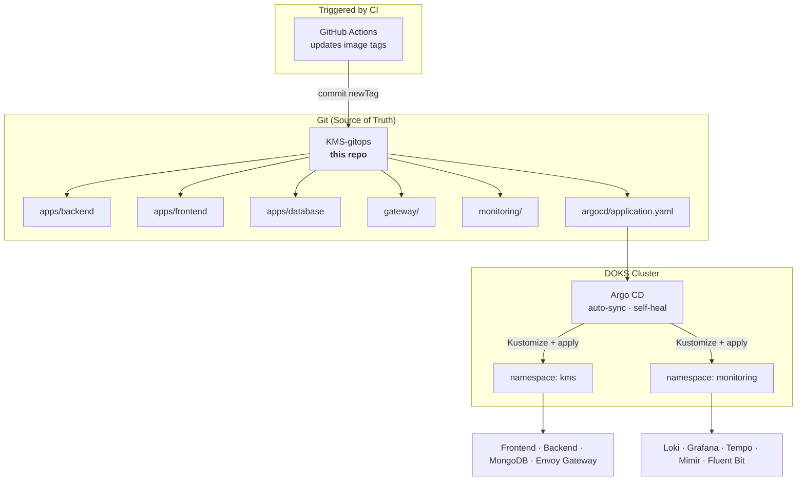

# KMS GitOps

Kubernetes manifests and Argo CD configuration — the **desired state** of everything running on the cluster.

## Architecture

```mermaid
flowchart TB
    subgraph git["Git (Source of Truth)"]
        MANIFESTS["KMS-gitops<br/><b>this repo</b>"]
        BE["apps/backend"]
        FE["apps/frontend"]
        DB["apps/database"]
        GW["gateway/"]
        MON["monitoring/"]
        ARGOAPP["argocd/application.yaml"]
    end

    subgraph cicd["Triggered by CI"]
        CI["GitHub Actions<br/>updates image tags"]
    end

    subgraph cluster["DOKS Cluster"]
        ARGO["Argo CD<br/>auto-sync · self-heal"]
        NS1["namespace: kms"]
        NS2["namespace: monitoring"]
    end

    CI -->|commit newTag| MANIFESTS
    MANIFESTS --> BE & FE & DB & GW & MON & ARGOAPP
    ARGOAPP --> ARGO
    ARGO -->|Kustomize + apply| NS1
    ARGO -->|Kustomize + apply| NS2

    NS1 --> STACK["Frontend · Backend · MongoDB · Envoy Gateway"]
    NS2 --> OBS["Loki · Grafana · Tempo · Mimir · Fluent Bit"]
```

## Three Repositories

| Repository | Role |
|------------|------|
| **KMS-app** | Application source code, Dockerfiles, GitHub Actions CI |
| **KMS-gitops** (here) | Kubernetes manifests, Kustomize, Argo CD applications |
| **KMS-infra** | Terraform (VPC, DOKS) + Ansible (cluster bootstrap) |

## What Gets Deployed

| Namespace | Components |
|-----------|------------|
| `kms` | Frontend, Backend, MongoDB, Gateway API routes |
| `monitoring` | Loki, Grafana, Tempo, Mimir, Fluent Bit |
| `argocd` | Argo CD (installed by Ansible, apps defined here) |
